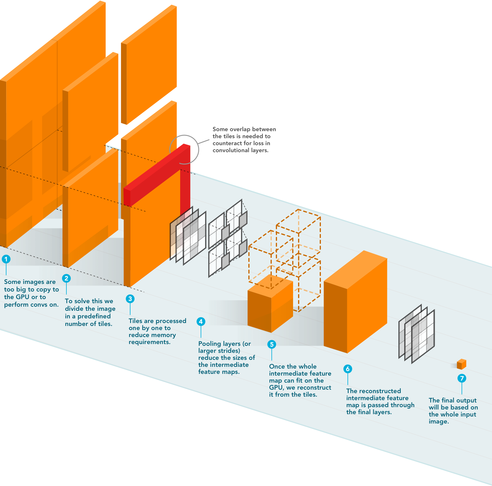

Whole-slide classification pipeline &mdash; end-to-end
======

This repository will give an overview on how to use [streaming](https://github.com/DIAGNijmegen/StreamingCNN) to train whole slides to single labels. Streaming is an implementation of convolutions using tiling and gradient checkpointing to save memory.




Papers until now about this method (please consider citing when using this code):

- _Application on prostate data, paper:_
H. Pinckaers, W. Bulten, J. Van der Laak and G. Litjens, "Detection of prostate cancer in whole-slide images through end-to-end training with image-level labels," in IEEE Transactions on Medical Imaging, doi: [10.1109/TMI.2021.3066295](https://ieeexplore.ieee.org/document/9380553) - Open Access.

- _Methods paper:_
H. Pinckaers, B. van Ginneken and G. Litjens, "Streaming convolutional neural networks for end-to-end learning with multi-megapixel images," in IEEE Transactions on Pattern Analysis and Machine Intelligence, doi: [10.1109/TPAMI.2020.3019563](https://ieeexplore.ieee.org/abstract/document/9178453) - [older preprint](http://arxiv.org/abs/1911.04432)

Other resources:

- MIDL 2018 (abstract, proof of concept): https://openreview.net/forum?id=HJ7lIcjoM
- Git repository of original method: https://github.com/DIAGNijmegen/StreamingCNN

## Requirements
**Packages:**
- Install [libvips](https://libvips.github.io/libvips/install.html) 
- See [requirements.txt](https://github.com/DIAGNijmegen/pathology-streaming-pipeline/blob/master/requirements.txt), install via ` pip install -r requirements.txt`
- Pytorch (1.6+) for mixedprecision support
- Make sure the repo is in your `$PYTHONPATH`

**Hardware requirements:**
 - GPU with 11 GB memory (smaller could work with smaller tile-sizes)
 - Preferably 32+ GB RAM (go for less workers when you have less memory available)
 
**Windows users**
 - Please see issues [#2](https://github.com/DIAGNijmegen/pathology-streaming-pipeline/issues/2) and [#3](https://github.com/DIAGNijmegen/pathology-streaming-pipeline/issues/3) for help with building the cpp extensions.
 
## Network

For now, only the *ResNet-34* implementation is checked. Other networks could be implemented (please make an issue, I can help).

## Input sizes

Recommended image sizes (microscopy magnification):

- 4096x4096 for spacing 4.0 (2.5x)
- 8192x8192 for spacing 2.0 (5x)
- 16384x16384 for spacing 1.0 (10x)

## Steps

### 0. Prepare train.csv and val.csv

For this pipeline you will need two csv files: `train` and `val.csv`. The syntax is easy:

```csv
slide_id,label
TRAIN_1,1
TRAIN_2,1
...
```

### 1. Prepare data

```bash
python streaming/trim_tissue.py \
    --csv='' \
    --slide-dir='' \
    --filetype='tif' \
    --save-dir='' \
    --output-spacing=1.0
```

### 2. Train network!
```bash
python streaming/train.py \
    --name=test-name \
    --train_csv='train.csv' \
    --val_csv='val.csv' \
    --data_dir='/local/data' \
    --save_dir='/home/user/models' \
    --lr=2e-4 \
    --num_workers=1 \
    --tile_size=5120
```


### 3. Options

There are quite some options (disable boolean options by prepending with `no_`, so e.g., `no_mixedprecision`):

| Required options | Description |
| ---:         |     :---      |
| `name: str` | The name of the current experiment, used for saving checkpoints. |
| `num_classes: int` | The number of classes in the task. |
| `train_csv: str` | The filenames (without extension) and labels of train set. |
| `val_csv: str` | The filenames (without extension) and labels of validation or test set. |
| `data_dir: str` | The directory where the images reside. |
| `save_dir: str` | Where to save the checkpoints. |
| **Optional options** | |
| `filetype: str` |  default: `'.jpg'`. The file-extension of the images. |
| **Train options** | |
| `lr: float` | default: `1e-4` . Learning rate. |
| `batch_size: int` | default: `16`. Effective mini-batch size. |
| `pretrained: bool` | default: `True`. Whether to use ImageNet weights. |
| `image_size: int` | default: `16384`. Effective input size of the network. |
| `tile_size: int` | default: `5120`. The input/tile size of the streaming-part of the network. |
| `epochs: int` | default: `50`. How many epochs to train. |
| `multilabel: bool` | default: `False`. |
| `regression: bool` | default: `False`. |
| **Validation options** | |
| `validation: bool` | default: `True`. Whether to run on validation set. |
| `validation_interval: int` | default: `1`. How many times to run on validation set, after n train epochs. |
| `epoch_multiply: int` | default: `1`. This will increase the size of one train epoch by reusing train images. |
| **Increase speed** | |
| `mixedprecision: bool` | default: `True`. Paper is trained with full precision, but this is faster. |
| `variable_input_shapes: bool` | default: `False`. When the images vary a lot with size, this helps with speed. |
| `normalize_on_gpu: bool` | default: `True`. Helps with RAM usage of dataloaders. |
| `num_workers: int` | default: `2`. Number of dataloader workers. |
| `convert_to_vips: bool` | default: `False`. |
| **Model options** | |
| `resnet: bool` | default: `True`. Only resnet is tested so far. |
| `mobilenet: bool` | default: `False`. Experimental. |
| `train_all_layers: bool` | default: `False`. Whether to finetune whole network, or only last block. |
| **Save and logging options** | |
| `resuming: bool` | default: `True`. Will restart from the last checkpoint with same experiment-name. |
| `resume_name: str` | default: `''`. Restart from another experiment with this name. |
| `resume_epoch: int` | default: `-1`. Restart from specific epoch. |
| `save: bool` | default: `True`. Save checkpoints. |
| `progressbar: bool` | default: `True`. Show the progressbar. |
| **Evaluation options** | |
| `weight_averaging: bool` | default: `False`. Average weights over 5 epochs around picked epoch. |
| `only_eval: bool` | default: `False`. Only do one evaluation epoch. |
| **Obscure train options** | |
| `gather_batch_on_one_gpu: bool` | default: `False`. |
| `accumulate_batch: int` | default: `-1`. Do not touch, is calculated automatically. |
| `weighted_sampler: bool` | default: `False`. Oversample minority class, only works in binary tasks. |
| `train_set_size: int` | default: `-1`. Sometimes you want to test on smaller train-set you can limit number here. |
| `train_streaming_layers: bool` | default: `True`. Whether to backpropagate the streaming-part of network. |
